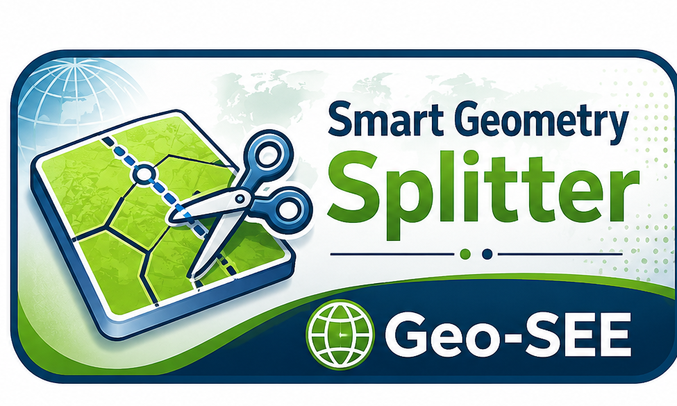

# Smart Geometry Splitter

Smart Geometry Splitter is a QGIS 3 plugin for splitting polygons and lines directly in the active editable vector layer.

## Version

1.0.0

## Main functions

### Polygon tools

1. Split polygon into 2 parts
   - Vertical
   - Horizontal
   - User-defined line
   - Boundary path + target area

2. Divide polygon into equal parts
   - Vertical
   - Horizontal
   - User-defined line

3. Divide polygon by area list + remainder
   - Vertical
   - Horizontal
   - User-defined line

### Line tools

1. Split line into 2 parts by target length
2. Divide line into equal parts
3. Divide line by length list + remainder

## Workflow

1. Load a polygon or line layer in QGIS.
2. Start editing mode.
3. Select exactly one feature.
4. Open Smart Geometry Splitter.
5. Click **Check Active Layer**.
6. Choose the desired tool.
7. Save layer edits after checking the result.

## Notes

- The plugin edits the active layer directly.
- Attributes are preserved from the original feature.
- For official QGIS plugin repository publication, update `homepage`, `repository`, and `tracker` in `metadata.txt` to match the public source repository before upload.
- Boundary path continuation for multi-part polygon subdivision is reserved for a future experimental version.

## License

GPL-3.0-or-later
